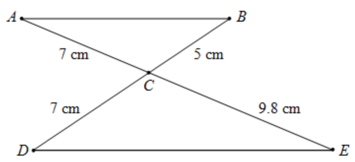

# Triangle Similarity: SAS Criterion

## I. Angle-Angle (AA) Criterion

The Angle-Angle (AA) criterion for triangle similarity states that two triangles are similar if two angles of one triangle are congruent to two angles of another triangle. This is because the sum of angles in any triangle is always 180 degrees, so if two angles are the same, the third must be as well. This leads to similarity due to all corresponding angles being equal.

In the above diagram, we have triangles $$ \triangle ACB $$ and $$ \triangle DCE $$. Angle $$ \angle ACB $$ is congruent to angle $$ \angle DCE $$ because they are vertically opposite angles, which are always equal.

However, the AA criterion cannot be applied to prove that $$ \triangle ACB $$ and $$ \triangle DCE $$ are similar since we only have one pair of congruent angles. Without knowing that a second pair of angles is congruent, we cannot satisfy the AA criterion.

## II. Side-Angle-Side (SAS) Criterion

But we know is two triangles are similar, the length of all 3 sides are enlarged or reduced on the same sacle factor, which give rise to another criterion for triangle similarity: Side-Angle-Side (SAS). SAS states that two triangles are similar if two sides of one triangle are in proportion to two sides of another triangle, and the angles included between those sides are congruent.

We will demonstrate that triangles $$ \triangle ACB $$ and $$ \triangle DCE $$ are similar by using the SAS criterion.

### Formal Proof Using SAS:

**Proof:**

1. The ratio of sides $$ AC $$ to $$ CE $$ is:
   $$ \frac{AC}{CE} = \frac{7}{9.8} = \frac{5}{7} $$

2. The ratio of sides $$ BC $$ to $$ DE $$ is:
   $$ \frac{BC}{DC} = \frac{5}{7} $$

3. Since $$ \frac{AC}{CE} = \frac{BC}{DC} $$, sides $$ AC $$ and $$ CE $$ are in the same proportion as sides $$ BC $$ and $$ DC $$.

4. $$ \angle ACB \cong \angle DCE $$ as they are vertically opposite angles.

5. By the SAS similarity criterion, $$ \triangle ACB \sim \triangle DCE $$.

### Self-Explanation Prompts
- Can we prove similarity by comparing $$ \frac{AC}{CD} $$ to $$ \frac{BC}{CE} $$
- Can we prove similarity by comparing $$ \frac{AC}{BC} $$ to $$ \frac{CD}{CE} $$

### Answers to Self-Explanation
1. No, as their ratios are different, this is because as $$ \triangle ACB $$ is enlarged to $$ \triangle DCE $$, the side $$ AC $$ is enlarged to $$ CE $$, not $$ CD $$. Similarly the side $$ BC $$ is enlarged to $$ DC $$, not $$ CE $$.
2. Yes, since all sides of $$ \triangle ACB $$ is enlarged by the same scale factor to form the sides of $$ \triangle DCE $$, the ratio between different sides on the same triangle should still be the same.

**Conclusion:**
Even though the AA criterion cannot be applied due to the lack of a second pair of congruent angles, the SAS criterion is satisfied through the proportionality of the sides and the congruence of the included angles. Therefore, $$ \triangle ACB $$ and $$ \triangle DCE $$ are similar.
