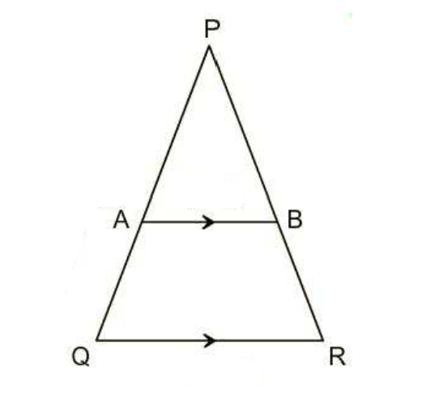
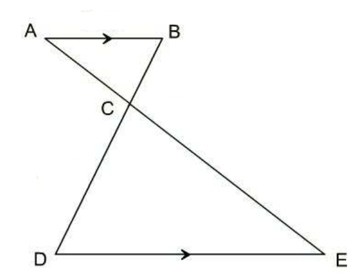
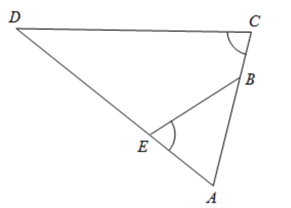
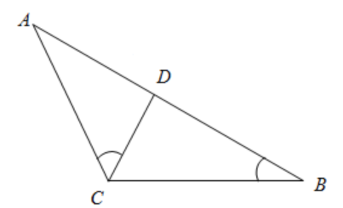

## Introduction to Similar Triangles and the AA Criteria

### Introduction to Similar Triangles
Similar triangles are geometric figures where one triangle is an enlarged or reduced version of another, maintaining the same shape. This scaling process changes the size of the triangle but does not alter its internal angles; they remain unchanged. Understanding that the angles remain the same is crucial because it allows us to use the Angle-Angle (AA) criterion to determine the similarity of two triangles.

### Importance of Unchanged Angles in Similar Triangles
When a triangle is scaled up or down, the lengths of the sides change proportionally. Despite these changes in size, the internal angles of the triangle remain constant. This invariant property of the angles is what makes the concept of similar triangles particularly useful in geometry. It means that if we can find two triangles with the same set of angles, one must be a scaled version of the other, confirming their similarity.

### Example 1:
Prove that triangles APB and QPR in the diagram below are similar.

**Diagram Analysis**:
- Triangles APB and QPR share a common angle at P.
- The sides AB and QR are parallel, indicating corresponding alternate interior angles are equal.

**Proof of Similarity**:
1. ∠APB = ∠QPR, because they are the same physical angle in both triangles.
2. ∠ABP = ∠QRP and ∠BAP = ∠PQR, because of the Corresponding Angles Theorem.
3. Apply the Angle-Angle (AA) criterion to conclude that ΔAPB ~ ΔQPR, since two angles of ΔAPB are equal to two angles of ΔQPR.

### Self-Explanation Prompts
- How do we identify which angles must be equal in order to prove similarity?
- In the questions, we proved 3 pairs of angles are equal, is this neccesary?

### Answers to Self-Explanation
1. Two similar triangles must share the same set of interior angles. We must first identify the 3 interior angles of APB and the 3 interior angles of QPR and make sure they are the same. 
2. No, once we have established that 2 pairs of angles are equal, the third pair must also be equal since the sum of angles in a triangle is always 180 degrees.

### Example 2:

Prove that triangles ABC and CDE in the diagram below are similar.

**Diagram Analysis**:
- Triangles ABC and CDE share vertex C.
- The sides AB and DE are indicated to be parallel.

**Proof of Similarity**:
1. Since AB is parallel to DE, by the Alternate Interior Angles Theorem, ∠ABC is equal to ∠CDE.
2. Similarly, angles BAC and CED are equal (alternate interior angles).
3. With two pairs of angles known to be equal, we can conclude by the Angle-Angle (AA) criterion that ΔABC ~ ΔCDE.

### Self-Explanation Prompt
- In the 2nd step, instead of showing angles BAC and CED are equal, can you show angle ACB equals angle DCE?

### Answer to Self-Explanation
Yes, ACB equals DCE as they are a pair of opposite angles.

### Example 3

**Question:**
Show that triangle ABE is similar to triangle ACD?

**Diagram Analysis**:
- Triangles ABE and ACD share vertex A.
- It is given that angles ∠AEB and ∠BCD are equal.

**Proof of Similarity**:
1. Given ∠AEB is equal to ∠BCD.
3. The angle ∠BAE is common to both triangles ABE and ACD.
4. Having established two pairs of angles as equal, by the Angle-Angle (AA) criterion, we can conclude that ΔABE ~ ΔACD.

### Self-Explanation Prompt
- In step 2, why don't we have to find another angle equal to ∠BAE?

### Answer to Self-Explanation
This is because ∠BAE is an interior angle to both ABE and ACD, this means both triangles automatically have 1 set of interior angles being the same just by sharing this angle.

### Example 4

**Question:**
In the diagram below, given the two marked angles （∠ACD and ∠DBC） are equal. Which pair of triangles are similar? Can you prove it?

**Diagram Analysis**:
- Triangles ACD and ACB share a common angle at A.

**Proof of Similarity**:
1. Given that ∠ACD is equal to ∠DBC.
2. Angle ∠CAB is common to both triangles ABC and ACD.
4. With two pairs of angles known to be equal, we conclude by the Angle-Angle (AA) criterion that ΔABC ~ ΔACD.

### Self-Explanation Prompt
- Why are triangles ACD and CDB not similar? Consider their angles and the information given.
- Think about why triangles CDB and ACB are also not similar. Why is the information given (∠ACD = ∠DBC) not useful for this situation.

### Answer to Self-Explanation
1. Triangles ACD and CDB are not similar because apart from the two marked angles being the same, there's no information suggesting they have any other pairs of equal angles (they do not share any common angles). 
2. Triangles CDB and ACB are not similar because, despite sharing an equal angle (∠B), there's no evidence to suggest that they have a second pair of equal angles. The information give is useless because ∠ACD is not an interior angle for either of these triangles.
 
